# ERD Actualizado — World Coffee Marketplace

## Versión post-auditoría frontend (commit `803d352`)

> **Fecha:** 2026-04-29
> **Auditor:** Arquitecto de bases de datos (rol)
> **ERD original:** `md/erd_marketplace_cafe_sostenible.html` (versión pre-frontend)
> **Estado del frontend auditado:** Fases 0–19 completas (rama `feature/login`)
> **Stack recomendado:** PostgreSQL 15+ con extensiones `uuid-ossp` y `pg_trgm`

---

## 1. Resumen ejecutivo

| Métrica | ERD original | ERD actualizado | Δ |
|---------|--------------|-----------------|----|
| Entidades totales | 20 | **39** | **+19** |
| Tablas pivote (N:M) | 1 (`product_certifications`) | **5** (+ `user_roles`, `farm_certifications`, `product_roast_levels`, `product_flavor_notes`) | +4 |
| Lookup tables / catálogos | 2 (`roles`, `certifications`) | **5** (+ `categories`, `roast_levels`, `shipping_options`, `payment_methods`) | +3 |
| Enums explícitos | 0 | **6** (`order_status`, `producer_status`, `payment_status`, `review_status`, `coupon_discount_type`, `address_type`) | +6 |
| Relaciones | 28 | **42** | +14 |
| Atributos críticos faltantes | — | 32 corregidos | — |

### Entidades nuevas (19) frente al ERD original

1. **`buyer_profiles`** — perfil del comprador (preferred_payment, newsletter_opt_in, avatar)
2. **`product_presentations`** — presentaciones del producto (250g/500g/1kg)
3. **`product_roast_levels`** — pivote producto↔nivel de tueste
4. **`roast_levels`** — catálogo de niveles de tueste
5. **`product_flavor_notes`** — notas de cata por producto
6. **`product_cupping`** — perfil sensorial (aroma/flavor/body/finish/acidity/score)
7. **`farm_certifications`** — pivote finca↔certificación con vencimiento
8. **`favorites`** — productos favoritos del comprador
9. **`coupons`** — cupones de descuento (CAFE10, etc.)
10. **`shipping_options`** — métodos de envío (estándar/express/recogida)
11. **`payment_methods`** — métodos de pago (Nequi/Bancolombia/Daviplata/BRE-B)
12. **`order_payments`** — registro del pago realizado por orden con comprobante
13. **`review_replies`** — respuesta del productor a reseñas
14. **`producer_documents`** — documentos de verificación del productor (renombre de `verification_documents`)
15. **`producer_approvals`** — solicitudes de aprobación con snapshot
16. **`approval_documents`** — documentos adjuntos a solicitudes de aprobación
17. **`admin_activity_log`** — registro de actividad administrativa
18. **`product_images`** — ya existía pero con relación 1:N detallada
19. **`order_status_history`** — historial de cambios de estado (renombre del original)

### Atributos clave añadidos a entidades existentes (selección)

- **`users.full_name`, `users.phone`** (faltaban en original)
- **`producer_profiles.city`, `producer_profiles.department`, `producer_profiles.avatar_initials`**
- **`addresses.line2`** (segunda línea de dirección, ahora opcional)
- **`addresses.is_default`** ya existía pero clarificado
- **`products.original_price`, `products.discount_percent`, `products.sold_count`, `products.region`, `products.emoji`**
- **`carts.coupon_id`, `carts.shipping_option_id`** (estado del carrito persistido)
- **`cart_items.unit_price_snapshot`** (precio congelado al momento de añadir)
- **`orders.code`** (código WCM-YYYY-NNN), **`orders.yearly_sequence`**, **`orders.year`**
- **`orders.subtotal`, `orders.shipping_amount`, `orders.discount_amount`** (desglose de cálculo)
- **`orders.shipping_address_snapshot`** (snapshot textual ante eliminación de address)
- **`order_items.product_name_snapshot`, `order_items.product_emoji_snapshot`** (denormalización deliberada)
- **`reviews.title`, `reviews.is_verified_purchase`, `reviews.helpful_count`, `reviews.status`**
- **`farms`** (+10 atributos): `main_variety`, `process`, `tree_count`, `harvest_season`, `annual_production_sacos`, `yield_per_ha`, `cupping_score`

### Cambios de enum/estado

- **`order_status`** ahora incluye **`pending_verification`** (estado inicial post-checkout sin pasarela de pagos — Fase 19)
- **`order_status`** ampliado: `pending_verification | confirmed | preparing | shipped | delivered | completed | cancelled`
- **`producer_status`**: `pending | approved | rejected` (formalizado como enum)
- **`payment_status`** (en `order_payments`): `submitted | verified | rejected | refunded`
- **`review_status`**: `published | hidden | reported`

---

## 2. Diagrama Mermaid

> El diagrama completo se encuentra en `md/erd_marketplace_v2.mmd`. Resumen visual:

```mermaid
erDiagram
  USERS ||--o{ USER_ROLES                : "tiene"
  ROLES ||--o{ USER_ROLES                : "asignado_a"
  USERS ||--o| BUYER_PROFILES            : "extiende"
  USERS ||--o| PRODUCER_PROFILES         : "extiende"
  USERS ||--o{ ADDRESSES                 : "registra"
  PRODUCER_PROFILES ||--|| FARMS         : "posee"
  FARMS ||--o{ FARM_CERTIFICATIONS       : "tiene"
  CERTIFICATIONS ||--o{ FARM_CERTIFICATIONS : "otorga"
  PRODUCER_PROFILES ||--o{ PRODUCTS      : "vende"
  CATEGORIES ||--o{ PRODUCTS             : "clasifica"
  PRODUCTS ||--o{ PRODUCT_IMAGES         : "muestra"
  PRODUCTS ||--o{ PRODUCT_CERTIFICATIONS : "certificado"
  PRODUCTS ||--o{ PRODUCT_PRESENTATIONS  : "ofrece"
  PRODUCTS ||--o{ PRODUCT_ROAST_LEVELS   : "tostado"
  PRODUCTS ||--o{ PRODUCT_FLAVOR_NOTES   : "perfil"
  PRODUCTS ||--|| PRODUCT_CUPPING        : "sensorial"
  PRODUCTS ||--|| INVENTORY              : "stock"
  USERS ||--|| CARTS                     : "posee"
  CARTS ||--o{ CART_ITEMS                : "contiene"
  USERS ||--o{ FAVORITES                 : "marca"
  COUPONS ||--o{ CARTS                   : "aplicado_a"
  SHIPPING_OPTIONS ||--o{ CARTS          : "elegida"
  USERS ||--o{ ORDERS                    : "realiza"
  ADDRESSES ||--o{ ORDERS                : "envío_a"
  ORDERS ||--o{ ORDER_ITEMS              : "incluye"
  ORDERS ||--|| ORDER_PAYMENTS           : "pagado"
  PAYMENT_METHODS ||--o{ ORDER_PAYMENTS  : "usado"
  ORDERS ||--o{ ORDER_STATUS_HISTORY     : "historial"
  PRODUCTS ||--o{ REVIEWS                : "reseña"
  USERS ||--o{ REVIEWS                   : "escribe"
  REVIEWS ||--o| REVIEW_REPLIES          : "respondida"
  USERS ||--o{ PRODUCER_APPROVALS        : "solicita"
  PRODUCER_APPROVALS ||--o{ APPROVAL_DOCUMENTS : "adjunta"
  USERS ||--o{ ADMIN_ACTIVITY_LOG        : "registra"
```



---

## 3. Entidades

### Módulo 1 — Identidad y autenticación

#### 3.1 `users`

| Campo | Tipo | PK/FK/UK | Nullable | Default | Descripción |
|-------|------|----------|----------|---------|-------------|
| id | UUID | PK | NO | gen_random_uuid() | Identificador único |
| email | VARCHAR(255) | UK | NO | — | Email único del usuario |
| password_hash | VARCHAR(255) | — | NO | — | Hash bcrypt/argon2 (NO almacenar password plano) |
| full_name | VARCHAR(150) | — | NO | — | Nombre completo (mostrado en navbar/perfil) |
| phone | VARCHAR(20) | — | YES | — | Teléfono opcional |
| status | VARCHAR(20) | — | NO | 'active' | active/disabled/banned |
| privacy_consent | BOOLEAN | — | NO | FALSE | RNF-PRI |
| created_at | TIMESTAMP | — | NO | NOW() | — |
| updated_at | TIMESTAMP | — | NO | NOW() | — |

**Relaciones**
- 1—1 → `buyer_profiles` (opcional, solo si role=BUYER)
- 1—1 → `producer_profiles` (opcional, solo si role=PRODUCER)
- 1—N → `user_roles` (tabla pivote con `roles`)
- 1—N → `addresses`, `orders`, `favorites`, `reviews`, `notifications`, `audit_logs`
- 1—1 → `carts`

**Índices**
- `UNIQUE INDEX users_email_idx ON users(email)`
- `INDEX users_status_idx ON users(status) WHERE status != 'active'`

#### 3.2 `roles`

| Campo | Tipo | PK/FK/UK | Default | Descripción |
|-------|------|----------|---------|-------------|
| id | SERIAL | PK | — | — |
| name | VARCHAR(50) | UK | — | buyer / producer / admin |
| description | VARCHAR(255) | — | — | — |

**Datos seed**: 3 filas: `(1,'buyer','Comprador')`, `(2,'producer','Productor')`, `(3,'admin','Administrador')`.

#### 3.3 `user_roles` (pivote)

| Campo | Tipo | PK/FK/UK | Default |
|-------|------|----------|---------|
| user_id | UUID | PK + FK→users | — |
| role_id | INTEGER | PK + FK→roles | — |
| assigned_at | TIMESTAMP | — | NOW() |

> **Nota:** El frontend asume **un único role por usuario** vía `Role` enum. Sin embargo, este pivote permite ampliar a multi-rol en el futuro sin migración compleja.

#### 3.4 `buyer_profiles` 🆕

| Campo | Tipo | PK/FK/UK | Nullable | Default | Descripción |
|-------|------|----------|----------|---------|-------------|
| id | UUID | PK | NO | gen_random_uuid() | — |
| user_id | UUID | FK→users + UK | NO | — | Relación 1:1 con users |
| city | VARCHAR(100) | — | YES | — | Ciudad de residencia |
| department | VARCHAR(100) | — | YES | — | Departamento |
| preferred_payment | VARCHAR(50) | — | YES | — | nequi/bancolombia/daviplata/breb |
| newsletter_opt_in | BOOLEAN | — | NO | FALSE | — |
| avatar_initials | VARCHAR(4) | — | YES | — | Iniciales generadas |
| created_at | TIMESTAMP | — | NO | NOW() | — |
| updated_at | TIMESTAMP | — | NO | NOW() | — |

**Justificación:** `BuyerProfileService` y `IBuyerProfile` exponen estos campos en el tab "Mi perfil" del comprador.

#### 3.5 `producer_profiles`

| Campo | Tipo | PK/FK/UK | Nullable | Default | Descripción |
|-------|------|----------|----------|---------|-------------|
| id | UUID | PK | NO | gen_random_uuid() | — |
| user_id | UUID | FK→users + UK | NO | — | — |
| bio | TEXT | — | YES | — | Descripción del productor |
| city | VARCHAR(100) | — | YES | — | — |
| department | VARCHAR(100) | — | YES | — | — |
| status | VARCHAR(20) | — | NO | 'pending' | pending/approved/rejected (enum `producer_status`) |
| rejection_reason | TEXT | — | YES | — | — |
| approved_by | UUID | FK→users | YES | — | Admin que aprobó |
| approved_at | TIMESTAMP | — | YES | — | — |
| avatar_initials | VARCHAR(4) | — | YES | — | — |
| created_at | TIMESTAMP | — | NO | NOW() | — |
| updated_at | TIMESTAMP | — | NO | NOW() | — |

**Índices**
- `INDEX producer_profiles_status_idx ON producer_profiles(status)`

#### 3.6 `producer_documents` (renombre de `verification_documents`)

| Campo | Tipo | PK/FK | Nullable | Descripción |
|-------|------|-------|----------|-------------|
| id | UUID | PK | NO | — |
| producer_id | UUID | FK→producer_profiles | NO | — |
| document_type | VARCHAR(80) | — | NO | cedula / rut / camara_comercio / certificacion |
| file_name | VARCHAR(255) | — | NO | — |
| file_url | VARCHAR(500) | — | NO | — |
| status | VARCHAR(20) | — | NO | pending/approved/rejected |
| uploaded_at | TIMESTAMP | — | NO | DEFAULT NOW() |

> **Estado frontend:** UI no implementada (HU-05 — D-30 deuda silenciosa). La tabla queda preparada.

#### 3.7 `addresses`

| Campo | Tipo | PK/FK | Nullable | Default | Descripción |
|-------|------|-------|----------|---------|-------------|
| id | UUID | PK | NO | gen_random_uuid() | — |
| user_id | UUID | FK→users | NO | — | — |
| label | VARCHAR(80) | — | NO | — | "Casa", "Oficina", etc. |
| line1 | VARCHAR(255) | — | NO | — | Línea principal |
| line2 | VARCHAR(255) | — | YES | — | 🆕 Apto, oficina, etc. |
| city | VARCHAR(100) | — | NO | — | — |
| department | VARCHAR(100) | — | NO | — | 🆕 (renombre de campo opcional) |
| zip_code | VARCHAR(20) | — | YES | — | 🆕 (renombre de `postal_code`) |
| is_default | BOOLEAN | — | NO | FALSE | Sólo una dirección por usuario puede ser default |
| created_at | TIMESTAMP | — | NO | NOW() | — |
| updated_at | TIMESTAMP | — | NO | NOW() | — |

**Constraints**
- `CHECK`: trigger que asegura sólo una `is_default=TRUE` por `user_id`.

**Índices**
- `INDEX addresses_user_id_idx ON addresses(user_id)`
- `UNIQUE INDEX addresses_user_default_idx ON addresses(user_id) WHERE is_default=TRUE`

#### 3.8 `password_reset_tokens`

Sin cambios respecto al original.

#### 3.9 `privacy_consents`

Sin cambios respecto al original.

---

### Módulo 2 — Catálogo y producto

#### 3.10 `farms` (ampliado)

| Campo | Tipo | PK/FK | Nullable | Descripción |
|-------|------|-------|----------|-------------|
| id | UUID | PK | NO | — |
| producer_id | UUID | FK→producer_profiles + UK | NO | 1:1 con productor |
| name | VARCHAR(150) | — | NO | — |
| municipality | VARCHAR(100) | — | NO | — |
| department | VARCHAR(100) | — | NO | — |
| altitude_masl | DECIMAL(7,2) | — | YES | Altitud en msnm |
| area_hectares | DECIMAL(8,2) | — | YES | Hectáreas |
| **main_variety** | VARCHAR(80) | — | YES | 🆕 Variedad principal (Caturra, Castillo, Geisha, Bourbon) |
| **process** | VARCHAR(50) | — | YES | 🆕 Lavado / Natural / Honey |
| **tree_count** | INTEGER | — | YES | 🆕 Cantidad de árboles |
| **harvest_season** | VARCHAR(100) | — | YES | 🆕 Temporada de cosecha |
| **annual_production_sacos** | DECIMAL(10,2) | — | YES | 🆕 Producción anual |
| **yield_per_ha** | DECIMAL(8,2) | — | YES | 🆕 Rendimiento por hectárea |
| **cupping_score** | DECIMAL(4,2) | — | YES | 🆕 Puntaje SCA general |
| description | TEXT | — | YES | — |
| created_at | TIMESTAMP | — | NO | DEFAULT NOW() |
| updated_at | TIMESTAMP | — | NO | DEFAULT NOW() |

**Justificación:** `FarmService` y `farm.model.ts` exponen estos atributos en el tab "Mi finca" del productor.

#### 3.11 `certifications` (catálogo)

| Campo | Tipo | PK/UK | Descripción |
|-------|------|-------|-------------|
| id | SERIAL | PK | — |
| code | VARCHAR(30) | UK | ORGANIC / FAIRTRADE / RAINFOREST |
| name | VARCHAR(100) | — | — |
| issuing_body | VARCHAR(150) | — | — |
| description | TEXT | — | — |
| icon_url | VARCHAR(500) | — | — |

#### 3.12 `farm_certifications` 🆕 (pivote)

| Campo | Tipo | PK/FK | Descripción |
|-------|------|-------|-------------|
| id | UUID | PK | — |
| farm_id | UUID | FK→farms | — |
| certification_id | INTEGER | FK→certifications | — |
| issuer | VARCHAR(150) | — | Organismo emisor concreto |
| issue_date | DATE | — | — |
| expiry_date | DATE | — | — |
| status | VARCHAR(20) | — | active/expired/revoked |
| document_url | VARCHAR(500) | — | — |
| notes | TEXT | — | — |

**Constraint:** `UNIQUE (farm_id, certification_id)`.

#### 3.13 `categories`

| Campo | Tipo | PK/FK/UK | Descripción |
|-------|------|----------|-------------|
| id | UUID | PK | — |
| name | VARCHAR(100) | UK | — |
| slug | VARCHAR(120) | UK | 🆕 SEO-friendly |
| description | TEXT | — | — |
| parent_id | UUID | FK→categories | Auto-relación para jerarquía |
| is_active | BOOLEAN | — | DEFAULT TRUE |
| icon_emoji | VARCHAR(10) | — | 🆕 |
| created_at | TIMESTAMP | — | DEFAULT NOW() |

**Justificación:** `AdminCategoryService` gestiona CRUD de categorías con activación/desactivación.

#### 3.14 `products` (ampliado significativamente)

| Campo | Tipo | PK/FK | Nullable | Descripción |
|-------|------|-------|----------|-------------|
| id | UUID | PK | NO | — |
| producer_id | UUID | FK→producer_profiles | NO | — |
| category_id | UUID | FK→categories | NO | — |
| name | VARCHAR(200) | — | NO | — |
| description | TEXT | — | YES | — |
| price | DECIMAL(12,2) | — | NO | CHECK ≥ 0 |
| **original_price** | DECIMAL(12,2) | — | YES | 🆕 Precio sin descuento |
| **discount_percent** | DECIMAL(5,2) | — | YES | 🆕 0–100 |
| **unit** | VARCHAR(20) | — | YES | 🆕 "x250g", "x500g" |
| **region** | VARCHAR(100) | — | YES | 🆕 Región (Huila, Nariño, etc.) |
| **emoji** | VARCHAR(10) | — | YES | 🆕 Emoji decorativo |
| **sold_count** | INTEGER | — | NO | 🆕 DEFAULT 0 |
| status | VARCHAR(20) | — | NO | DEFAULT 'draft' (draft/published/archived) |
| created_at | TIMESTAMP | — | NO | DEFAULT NOW() |
| updated_at | TIMESTAMP | — | NO | DEFAULT NOW() |

**Índices críticos**
- `INDEX products_producer_id_idx ON products(producer_id)`
- `INDEX products_category_id_idx ON products(category_id)`
- `INDEX products_status_idx ON products(status)`
- `INDEX products_name_trgm ON products USING gin (name gin_trgm_ops)` — para autocomplete con `pg_trgm`

#### 3.15 `product_images`

Sin cambios estructurales respecto al original (id, product_id, image_url, display_order, uploaded_at).

#### 3.16 `product_certifications` (pivote)

Sin cambios significativos.

#### 3.17 `product_presentations` 🆕

| Campo | Tipo | PK/FK | Descripción |
|-------|------|-------|-------------|
| id | UUID | PK | — |
| product_id | UUID | FK→products | — |
| presentation | VARCHAR(50) | — | "250g", "500g", "1kg" |
| extra_price | DECIMAL(10,2) | — | Sobreprecio respecto al precio base |
| display_order | INTEGER | — | DEFAULT 0 |

**Justificación:** `IProduct.presentationTypes: string[]` en el frontend; necesita normalizarse en backend.

#### 3.18 `roast_levels` 🆕 (catálogo)

| Campo | Tipo | PK/UK | Descripción |
|-------|------|-------|-------------|
| id | SERIAL | PK | — |
| code | VARCHAR(20) | UK | light / medium / dark |
| name | VARCHAR(50) | — | — |
| description | VARCHAR(255) | — | — |
| icon | VARCHAR(10) | — | — |

#### 3.19 `product_roast_levels` 🆕 (pivote)

| Campo | Tipo | PK/FK |
|-------|------|-------|
| product_id | UUID | PK + FK→products |
| roast_level_id | INTEGER | PK + FK→roast_levels |

**Constraint:** `UNIQUE (product_id, roast_level_id)`.

#### 3.20 `product_flavor_notes` 🆕

| Campo | Tipo | PK/FK | Descripción |
|-------|------|-------|-------------|
| id | UUID | PK | — |
| product_id | UUID | FK→products | — |
| name | VARCHAR(80) | — | "Chocolate", "Caramelo", "Cítrico" |
| icon | VARCHAR(10) | — | — |
| intensity | SMALLINT | — | 0–100 |

#### 3.21 `product_cupping` 🆕 (1:1 con products)

| Campo | Tipo | PK/FK | Descripción |
|-------|------|-------|-------------|
| product_id | UUID | PK + FK→products | — |
| score | DECIMAL(4,2) | — | 0–100 (puntaje SCA) |
| aroma | SMALLINT | — | 0–10 |
| flavor | SMALLINT | — | 0–10 |
| body | SMALLINT | — | 0–10 |
| finish | SMALLINT | — | 0–10 |
| acidity | SMALLINT | — | 0–10 |

**Justificación:** `IProduct.cuppingScore` y `cuppingAttributes` requieren tabla dedicada.

#### 3.22 `inventory`

| Campo | Tipo | PK/FK/UK | Descripción |
|-------|------|----------|-------------|
| id | UUID | PK | — |
| product_id | UUID | FK + UK | 1:1 con product |
| quantity | INTEGER | — | DEFAULT 0 + CHECK ≥ 0 |
| **max_stock** | INTEGER | — | 🆕 Stock máximo permitido |
| updated_at | TIMESTAMP | — | DEFAULT NOW() |

---

### Módulo 3 — Carrito y favoritos

#### 3.23 `carts` (ampliado)

| Campo | Tipo | PK/FK/UK | Nullable | Descripción |
|-------|------|----------|----------|-------------|
| id | UUID | PK | NO | — |
| user_id | UUID | FK→users + UK | NO | 1:1 con usuario |
| **coupon_id** | INTEGER | FK→coupons | YES | 🆕 Cupón aplicado |
| **shipping_option_id** | VARCHAR(20) | FK→shipping_options | YES | 🆕 Opción seleccionada |
| created_at | TIMESTAMP | — | NO | DEFAULT NOW() |
| updated_at | TIMESTAMP | — | NO | DEFAULT NOW() |

**Justificación:** `CartService` mantiene `couponCode` y `shippingOptionId` como signals — son estado persistido del carrito.

#### 3.24 `cart_items` (ampliado)

| Campo | Tipo | PK/FK | Nullable | Descripción |
|-------|------|-------|----------|-------------|
| id | UUID | PK | NO | — |
| cart_id | UUID | FK→carts | NO | — |
| product_id | UUID | FK→products | NO | — |
| quantity | INTEGER | — | NO | CHECK ≥ 1 |
| **unit_price_snapshot** | DECIMAL(12,2) | — | NO | 🆕 Precio congelado |
| added_at | TIMESTAMP | — | NO | DEFAULT NOW() |

**Constraint:** `UNIQUE (cart_id, product_id)` — un producto aparece una sola vez por carrito.

#### 3.25 `favorites` 🆕

| Campo | Tipo | PK/FK | Descripción |
|-------|------|-------|-------------|
| id | UUID | PK | — |
| user_id | UUID | FK→users | — |
| product_id | UUID | FK→products | — |
| added_at | TIMESTAMP | — | DEFAULT NOW() |

**Constraint:** `UNIQUE (user_id, product_id)`.
**Justificación:** `FavoritesService` y `IFavorite` en el tab "Favoritos" del comprador.

#### 3.26 `coupons` 🆕

| Campo | Tipo | PK/UK | Descripción |
|-------|------|-------|-------------|
| id | SERIAL | PK | — |
| code | VARCHAR(40) | UK | "CAFE10" |
| description | VARCHAR(255) | — | — |
| discount_type | VARCHAR(20) | — | percent / fixed |
| discount_value | DECIMAL(12,2) | — | 10.00 (% o monto absoluto) |
| min_subtotal | DECIMAL(12,2) | — | DEFAULT 0 |
| usage_limit | INTEGER | — | NULL = ilimitado |
| used_count | INTEGER | — | DEFAULT 0 |
| valid_from | TIMESTAMP | — | — |
| valid_until | TIMESTAMP | — | — |
| is_active | BOOLEAN | — | DEFAULT TRUE |

**Datos seed:** `('CAFE10','Descuento bienvenida','percent',10,0,NULL,0,...,TRUE)`.
**Justificación:** Frontend tiene cupón hardcoded `CAFE10`. Promoverlo a tabla.

#### 3.27 `shipping_options` 🆕

| Campo | Tipo | PK | Descripción |
|-------|------|-----|-------------|
| id | VARCHAR(20) | PK | "standard"/"express"/"pickup" |
| name | VARCHAR(80) | — | — |
| delivery_window | VARCHAR(80) | — | "3-5 días", "1-2 días", "Recoger" |
| price | DECIMAL(10,2) | — | — |
| is_active | BOOLEAN | — | DEFAULT TRUE |
| display_order | INTEGER | — | — |

**Justificación:** `SHIPPING_OPTIONS` en `shipping.model.ts` — debe normalizarse en backend.

---

### Módulo 4 — Pedidos

#### 3.28 `orders` (ampliado significativamente)

| Campo | Tipo | PK/FK/UK | Nullable | Descripción |
|-------|------|----------|----------|-------------|
| id | UUID | PK | NO | — |
| buyer_id | UUID | FK→users | NO | (renombre de `user_id` por claridad) |
| address_id | UUID | FK→addresses | NO | — |
| **shipping_option_id** | VARCHAR(20) | FK→shipping_options | NO | 🆕 |
| **coupon_id** | INTEGER | FK→coupons | YES | 🆕 |
| **code** | VARCHAR(20) | UK | NO | 🆕 "WCM-2026-001" |
| **yearly_sequence** | INTEGER | — | NO | 🆕 Componente NNN del code |
| **year** | INTEGER | — | NO | 🆕 Componente YYYY del code |
| **subtotal** | DECIMAL(14,2) | — | NO | 🆕 Sin envío ni descuento |
| **shipping_amount** | DECIMAL(12,2) | — | NO | 🆕 DEFAULT 0 |
| **discount_amount** | DECIMAL(12,2) | — | NO | 🆕 DEFAULT 0 |
| total_amount | DECIMAL(14,2) | — | NO | subtotal + shipping − discount |
| status | VARCHAR(30) | — | NO | DEFAULT `'pending_verification'` 🆕 |
| **shipping_address_snapshot** | TEXT | — | NO | 🆕 Snapshot textual ante eliminación de address |
| created_at | TIMESTAMP | — | NO | DEFAULT NOW() |
| updated_at | TIMESTAMP | — | NO | DEFAULT NOW() |

**Constraint:** `UNIQUE (year, yearly_sequence)`.

**Enum `order_status`:**
```sql
CREATE TYPE order_status AS ENUM (
  'pending_verification', -- post-checkout, esperando comprobante
  'confirmed',            -- pago verificado
  'preparing',
  'shipped',
  'delivered',
  'completed',
  'cancelled'
);
```

**Índices críticos**
- `INDEX orders_buyer_id_idx ON orders(buyer_id)`
- `INDEX orders_status_idx ON orders(status)`
- `UNIQUE INDEX orders_code_idx ON orders(code)`
- `INDEX orders_created_at_idx ON orders(created_at DESC)` — para listados

#### 3.29 `order_items` (ampliado)

| Campo | Tipo | PK/FK | Nullable | Descripción |
|-------|------|-------|----------|-------------|
| id | UUID | PK | NO | — |
| order_id | UUID | FK→orders | NO | — |
| product_id | UUID | FK→products | NO | — |
| **product_name_snapshot** | VARCHAR(200) | — | NO | 🆕 Denormalizado |
| **product_emoji_snapshot** | VARCHAR(10) | — | YES | 🆕 |
| quantity | INTEGER | — | NO | CHECK ≥ 1 |
| unit_price_snapshot | DECIMAL(12,2) | — | NO | (renombre de `unit_price`) |
| subtotal | DECIMAL(14,2) | — | NO | quantity × unit_price |

> **Decisión deliberada:** snapshot de nombre/emoji evita perder información histórica si el productor renombra el producto.

#### 3.30 `order_status_history`

Sin cambios estructurales respecto al original.

---

### Módulo 5 — Pagos

#### 3.31 `payment_methods` 🆕 (catálogo)

| Campo | Tipo | PK/UK | Nullable | Descripción |
|-------|------|-------|----------|-------------|
| id | UUID | PK | NO | — |
| code | VARCHAR(30) | UK | NO | nequi / bancolombia / daviplata / breb |
| name | VARCHAR(80) | — | NO | — |
| type | VARCHAR(30) | — | NO | wallet / bank_account / instant_transfer |
| account_number | VARCHAR(80) | — | YES | Número, cuenta o identificador |
| account_holder | VARCHAR(150) | — | YES | Titular ("World Coffee Marketplace SAS") |
| bank | VARCHAR(80) | — | YES | "Bancolombia" |
| alias | VARCHAR(80) | — | YES | — |
| nit | VARCHAR(30) | — | YES | "900.542.310-7" |
| emoji | VARCHAR(10) | — | YES | "📱" "🏦" "💜" "⚡" |
| accent_color | VARCHAR(10) | — | YES | "#6C0E99" |
| is_active | BOOLEAN | — | NO | DEFAULT TRUE |
| display_order | INTEGER | — | NO | DEFAULT 0 |

**Datos seed:** 4 filas correspondientes a Nequi, Bancolombia, Daviplata, BRE-B (extraídos de `CheckoutOverlayComponent`).

#### 3.32 `order_payments` 🆕

| Campo | Tipo | PK/FK/UK | Nullable | Descripción |
|-------|------|----------|----------|-------------|
| id | UUID | PK | NO | — |
| order_id | UUID | FK→orders + UK | NO | 1:1 con orden |
| payment_method_id | UUID | FK→payment_methods | YES | — |
| payment_method_code | VARCHAR(30) | — | NO | Snapshot del code |
| amount | DECIMAL(14,2) | — | NO | — |
| status | VARCHAR(20) | — | NO | submitted/verified/rejected/refunded |
| reference | VARCHAR(200) | — | YES | Referencia de la transferencia |
| proof_url | VARCHAR(500) | — | YES | URL del comprobante (cuando se cargue) |
| submitted_at | TIMESTAMP | — | YES | — |
| verified_at | TIMESTAMP | — | YES | — |
| verified_by | UUID | FK→users | YES | Admin que verificó |

> **Reemplaza la tabla `payments` del original** que asumía pasarela con `gateway_reference` y `gateway_signature`. WCM no usa pasarela; el comprador realiza transferencia y envía comprobante por WhatsApp.

---

### Módulo 6 — Social

#### 3.33 `reviews` (ampliado)

| Campo | Tipo | PK/FK | Nullable | Descripción |
|-------|------|-------|----------|-------------|
| id | UUID | PK | NO | — |
| product_id | UUID | FK→products | NO | — |
| buyer_id | UUID | FK→users | NO | (renombre de `user_id`) |
| order_id | UUID | FK→orders | NO | Garantiza compra verificada |
| rating | SMALLINT | — | NO | CHECK 1–5 |
| **title** | VARCHAR(120) | — | YES | 🆕 |
| body | TEXT | — | YES | (renombre de `comment`) |
| **status** | VARCHAR(20) | — | NO | 🆕 published/hidden/reported |
| **is_verified_purchase** | BOOLEAN | — | NO | 🆕 DEFAULT TRUE |
| **helpful_count** | INTEGER | — | NO | 🆕 DEFAULT 0 |
| created_at | TIMESTAMP | — | NO | DEFAULT NOW() |
| **updated_at** | TIMESTAMP | — | NO | 🆕 DEFAULT NOW() |

**Constraint:** `UNIQUE (buyer_id, product_id)`.

#### 3.34 `review_replies` 🆕

| Campo | Tipo | PK/FK/UK | Descripción |
|-------|------|----------|-------------|
| id | UUID | PK | — |
| review_id | UUID | FK→reviews + UK | 1:1 |
| producer_id | UUID | FK→producer_profiles | — |
| body | TEXT | — | — |
| created_at | TIMESTAMP | — | DEFAULT NOW() |
| updated_at | TIMESTAMP | — | DEFAULT NOW() |

**Justificación:** `ProducerReviewService.reply()` permite al productor responder reseñas (D-12 del PLAN_REAL).

---

### Módulo 7 — Admin

#### 3.35 `producer_approvals` 🆕

| Campo | Tipo | PK/FK | Nullable | Descripción |
|-------|------|-------|----------|-------------|
| id | UUID | PK | NO | — |
| producer_id | UUID | FK→producer_profiles | NO | — |
| producer_name_snapshot | VARCHAR(150) | — | NO | — |
| farm_name_snapshot | VARCHAR(150) | — | YES | — |
| region | VARCHAR(100) | — | YES | — |
| department | VARCHAR(100) | — | YES | — |
| hectares | DECIMAL(8,2) | — | YES | — |
| main_variety | VARCHAR(80) | — | YES | — |
| email | VARCHAR(255) | — | NO | — |
| phone | VARCHAR(20) | — | YES | — |
| status | VARCHAR(20) | — | NO | DEFAULT 'pending' |
| rejection_reason | TEXT | — | YES | — |
| reviewed_by | UUID | FK→users | YES | — |
| reviewed_at | TIMESTAMP | — | YES | — |
| submitted_at | TIMESTAMP | — | NO | DEFAULT NOW() |

**Justificación:** `ProducerApprovalService` y `IProducerApproval` con seeds de 6 aprobaciones (3 pending + 2 approved + 1 rejected).

#### 3.36 `approval_documents` 🆕

| Campo | Tipo | PK/FK | Descripción |
|-------|------|-------|-------------|
| id | UUID | PK | — |
| approval_id | UUID | FK→producer_approvals | — |
| name | VARCHAR(255) | — | — |
| type | VARCHAR(80) | — | cedula / rut / camara_comercio |
| url | VARCHAR(500) | — | — |
| uploaded_at | TIMESTAMP | — | DEFAULT NOW() |

#### 3.37 `admin_activity_log` 🆕

| Campo | Tipo | PK/FK | Nullable | Descripción |
|-------|------|-------|----------|-------------|
| id | UUID | PK | NO | — |
| actor_id | UUID | FK→users | YES | Quien ejecutó la acción |
| actor_name_snapshot | VARCHAR(150) | — | NO | — |
| type | VARCHAR(50) | — | NO | producer_approved / category_created / user_disabled / etc. |
| title | VARCHAR(200) | — | NO | — |
| description | TEXT | — | YES | — |
| severity | VARCHAR(20) | — | NO | DEFAULT 'info' (info/warning/critical) |
| icon_emoji | VARCHAR(10) | — | YES | — |
| metadata | JSONB | — | YES | — |
| created_at | TIMESTAMP | — | NO | DEFAULT NOW() |

**Justificación:** `AdminActivityService` con seeds de 10 eventos.

---

### Módulo 8 — Auditoría y notificaciones

#### 3.38 `notifications`

Sin cambios estructurales respecto al original.

#### 3.39 `audit_logs`

Sin cambios estructurales respecto al original.

---

## 4. Enums y lookup tables

### 4.1 Enums recomendados (PostgreSQL `CREATE TYPE`)

```sql
CREATE TYPE order_status AS ENUM (
  'pending_verification', 'confirmed', 'preparing',
  'shipped', 'delivered', 'completed', 'cancelled'
);

CREATE TYPE producer_status AS ENUM ('pending', 'approved', 'rejected');

CREATE TYPE payment_status AS ENUM ('submitted', 'verified', 'rejected', 'refunded');

CREATE TYPE review_status AS ENUM ('published', 'hidden', 'reported');

CREATE TYPE coupon_discount_type AS ENUM ('percent', 'fixed');

CREATE TYPE doc_status AS ENUM ('pending', 'approved', 'rejected');
```

### 4.2 Lookup tables (catálogos persistidos)

| Tabla | Filas seed |
|-------|------------|
| `roles` | 3 (buyer, producer, admin) |
| `certifications` | 3 (ORGANIC, FAIRTRADE, RAINFOREST) |
| `categories` | 6+ (Espressos, Filtrados, Especiales, Decafeinados, ...) |
| `roast_levels` | 3 (light, medium, dark) |
| `shipping_options` | 3 (standard, express, pickup) |
| `payment_methods` | 4 (Nequi, Bancolombia, Daviplata, BRE-B) |
| `coupons` | 1+ (CAFE10) |

---

## 5. Tabla de gaps (ERD original vs frontend real)

| # | Categoría | Item | ERD original | Frontend real | Acción |
|---|-----------|------|--------------|---------------|--------|
| G-01 | Atributo faltante | `users.full_name`, `users.phone` | ❌ | ✅ usado en perfil/navbar | Añadir |
| G-02 | Entidad faltante | `buyer_profiles` | ❌ | ✅ `BuyerProfileService` | Crear |
| G-03 | Atributo faltante | `producer_profiles.city`, `.department`, `.avatar_initials` | ❌ | ✅ | Añadir |
| G-04 | Atributo faltante | `addresses.line2` | ❌ | ✅ Fase 18 | Añadir |
| G-05 | Renombre | `addresses.postal_code` → `addresses.zip_code` | postal_code | zipCode | Renombrar |
| G-06 | Atributo faltante | `addresses.created_at`/`updated_at` | ❌ | ✅ | Añadir |
| G-07 | Atributo faltante | `farms.main_variety`, `process`, `tree_count`, `harvest_season`, `annual_production_sacos`, `yield_per_ha`, `cupping_score` | ❌ | ✅ `farm.model.ts` | Añadir 7 atributos |
| G-08 | Entidad faltante | `farm_certifications` (pivote N:M con expiry/issuer) | ❌ | ✅ producer-profile certifications | Crear pivote |
| G-09 | Atributo faltante | `categories.slug`, `.icon_emoji`, `.description` | ❌ | ✅ admin-category | Añadir |
| G-10 | Atributo faltante | `products.original_price`, `discount_percent`, `region`, `emoji`, `unit`, `sold_count` | ❌ | ✅ `product.model.ts` | Añadir 6 atributos |
| G-11 | Entidad faltante | `product_presentations` | ❌ | ✅ `presentationTypes: string[]` | Crear (normalizar) |
| G-12 | Entidad faltante | `roast_levels` + `product_roast_levels` | ❌ | ✅ `roastLevels: IRoastLevel[]` | Crear catálogo + pivote |
| G-13 | Entidad faltante | `product_flavor_notes` | ❌ | ✅ `flavorNotes: IFlavorNote[]` | Crear |
| G-14 | Entidad faltante | `product_cupping` (1:1 con products) | ❌ | ✅ `cuppingScore`, `cuppingAttributes` | Crear |
| G-15 | Atributo faltante | `inventory.max_stock` | ❌ | ✅ frontend usa `maxStock` | Añadir |
| G-16 | Entidad faltante | `favorites` | ❌ | ✅ `FavoritesService` | Crear |
| G-17 | Entidad faltante | `coupons` | ❌ | ✅ CAFE10 hardcoded | Crear |
| G-18 | Entidad faltante | `shipping_options` | ❌ | ✅ `SHIPPING_OPTIONS` const | Crear |
| G-19 | Atributo faltante | `carts.coupon_id`, `.shipping_option_id` | ❌ | ✅ persistido en service | Añadir |
| G-20 | Renombre/snapshot | `cart_items.unit_price` → `unit_price_snapshot` | unit_price | snapshot | Renombrar |
| G-21 | Atributo faltante | `orders.code`, `yearly_sequence`, `year` | ❌ (`order_number` existía pero sin secuencia) | ✅ `WCM-YYYY-NNN` | Añadir 3 campos |
| G-22 | Atributo faltante | `orders.subtotal`, `shipping_amount`, `discount_amount`, `shipping_option_id`, `coupon_id`, `shipping_address_snapshot` | ❌ | ✅ frontend calcula desglose | Añadir 6 campos |
| G-23 | Enum incompleto | `order_status` carece de `pending_verification` | ❌ | ✅ Fase 19 | Añadir valor |
| G-24 | Atributo faltante | `order_items.product_name_snapshot`, `product_emoji_snapshot` | ❌ | ✅ persistido en order | Añadir 2 campos |
| G-25 | Reemplazo | `payments` (con gateway) → `order_payments` (sin gateway) | gateway_reference, gateway_signature | reference, proof_url | Reemplazar tabla |
| G-26 | Entidad faltante | `payment_methods` (catálogo de 4 métodos colombianos) | ❌ | ✅ `CheckoutOverlayComponent` | Crear |
| G-27 | Atributo faltante | `reviews.title`, `status`, `is_verified_purchase`, `helpful_count`, `updated_at` | ❌ | ✅ `IReview` | Añadir 5 atributos |
| G-28 | Renombre | `reviews.comment` → `reviews.body` | comment | body | Renombrar |
| G-29 | Entidad faltante | `review_replies` | ❌ | ✅ `ProducerReviewService.reply()` | Crear |
| G-30 | Entidad faltante | `producer_approvals` (snapshot) + `approval_documents` | ❌ | ✅ `ProducerApprovalService` | Crear 2 tablas |
| G-31 | Entidad faltante | `admin_activity_log` | ❌ | ✅ `AdminActivityService` | Crear |
| G-32 | Renombre | `verification_documents` → `producer_documents` | nombre | nombre | Renombrar |

---

## 6. Cambios respecto al ERD original

| ID | Cambio | Tipo | Justificación |
|----|--------|------|---------------|
| C-01 | Tabla `buyer_profiles` añadida | 🆕 Nueva entidad | `BuyerProfileService` extiende perfil del comprador |
| C-02 | Tabla `addresses` ampliada con `line2`, `created_at`, `updated_at`; renombre `postal_code` → `zip_code` | ⚠️ Cambio | Fase 18 — CRUD completo de direcciones |
| C-03 | `producer_status` formalizado como enum con valores `pending/approved/rejected` | ⚠️ Cambio | `ProducerStatus` enum del frontend |
| C-04 | Tabla `farms` ampliada con 7 atributos (main_variety, process, tree_count, harvest_season, annual_production_sacos, yield_per_ha, cupping_score) | ⚠️ Cambio | Tab "Mi finca" del productor |
| C-05 | Tabla `farm_certifications` añadida como pivote N:M con `expiry_date` y `status` | 🆕 Nueva entidad | Certificaciones por finca con vigencia |
| C-06 | `categories.parent_id` cambia de `INTEGER` a `UUID` para auto-relación | ⚠️ Cambio | Consistencia de tipos PK |
| C-07 | Tabla `products` ampliada con 6 atributos (original_price, discount_percent, unit, region, emoji, sold_count) | ⚠️ Cambio | `IProduct` extendido |
| C-08 | Tablas `product_presentations`, `roast_levels`, `product_roast_levels`, `product_flavor_notes`, `product_cupping` añadidas | 🆕 5 nuevas entidades | Normalización del perfil sensorial |
| C-09 | `inventory.max_stock` añadido | ⚠️ Cambio | Stock máximo del producto |
| C-10 | Tabla `favorites` añadida | 🆕 Nueva entidad | `FavoritesService` |
| C-11 | Tabla `coupons` añadida | 🆕 Nueva entidad | Cupón `CAFE10` hardcoded promovido a tabla |
| C-12 | Tabla `shipping_options` añadida | 🆕 Nueva entidad | Opciones de envío persistidas |
| C-13 | `carts` añade FK a `coupons` y `shipping_options` | ⚠️ Cambio | Estado de checkout persistido |
| C-14 | `cart_items.unit_price` renombrado a `unit_price_snapshot` | ⚠️ Cambio | Claridad de denormalización |
| C-15 | `orders` añade `code`, `yearly_sequence`, `year`, `subtotal`, `shipping_amount`, `discount_amount`, `shipping_option_id`, `coupon_id`, `shipping_address_snapshot` | ⚠️ Cambio mayor | Código WCM-YYYY-NNN + desglose financiero (Fase 19) |
| C-16 | Enum `order_status` añade `pending_verification` | ⚠️ Cambio | Estado inicial sin pasarela (Fase 19) |
| C-17 | `order_items` añade `product_name_snapshot`, `product_emoji_snapshot` | ⚠️ Cambio | Snapshot histórico |
| C-18 | Tabla `payments` reemplazada por `order_payments` (sin gateway) | ⚠️ Cambio mayor | WCM no usa pasarela; transferencia + comprobante WhatsApp |
| C-19 | Tabla `payment_methods` añadida (catálogo de 4 métodos colombianos) | 🆕 Nueva entidad | `CheckoutOverlayComponent` |
| C-20 | `reviews` añade `title`, `status`, `is_verified_purchase`, `helpful_count`, `updated_at`; renombre `comment` → `body` | ⚠️ Cambio | `IReview` extendido |
| C-21 | Tabla `review_replies` añadida | 🆕 Nueva entidad | Respuesta del productor a reseña |
| C-22 | Tabla `producer_approvals` + `approval_documents` añadidas con snapshots | 🆕 2 nuevas entidades | `ProducerApprovalService` |
| C-23 | Tabla `admin_activity_log` añadida | 🆕 Nueva entidad | `AdminActivityService` |
| C-24 | `verification_documents` renombrado a `producer_documents` | ⚠️ Renombre | Coherencia con dominio |

---

## 7. Recomendaciones para el backend

### 7.1 Stack recomendado

- **PostgreSQL 15+** con extensiones:
  - `uuid-ossp` (o `pgcrypto`) — generación de UUIDs
  - `pg_trgm` — búsqueda fuzzy en `products.name` (autocomplete)
  - `citext` — case-insensitive emails
- **Migraciones:** Flyway / Alembic / Knex (según stack backend elegido)
- **ORM/Query Builder:** Prisma, TypeORM o Drizzle (TypeScript-first, alineado con frontend)
- **Pool de conexiones:** PgBouncer en transaction mode

### 7.2 Índices críticos (P0)

```sql
-- Búsquedas comunes
CREATE INDEX users_email_idx ON users(LOWER(email));
CREATE INDEX products_producer_id_idx ON products(producer_id);
CREATE INDEX products_category_id_idx ON products(category_id);
CREATE INDEX products_status_idx ON products(status) WHERE status = 'published';
CREATE INDEX products_name_trgm ON products USING gin (name gin_trgm_ops);

-- Pedidos
CREATE INDEX orders_buyer_id_idx ON orders(buyer_id);
CREATE INDEX orders_status_idx ON orders(status);
CREATE UNIQUE INDEX orders_code_idx ON orders(code);
CREATE INDEX orders_created_at_idx ON orders(created_at DESC);
CREATE UNIQUE INDEX orders_year_seq_idx ON orders(year, yearly_sequence);

-- Reseñas
CREATE INDEX reviews_product_id_idx ON reviews(product_id);
CREATE UNIQUE INDEX reviews_buyer_product_idx ON reviews(buyer_id, product_id);

-- Direcciones default
CREATE UNIQUE INDEX addresses_user_default_idx ON addresses(user_id) WHERE is_default = TRUE;

-- Favoritos
CREATE UNIQUE INDEX favorites_user_product_idx ON favorites(user_id, product_id);
```

### 7.3 Constraints críticos (P0)

```sql
-- Calidad de datos
ALTER TABLE products ADD CONSTRAINT products_price_positive CHECK (price >= 0);
ALTER TABLE products ADD CONSTRAINT products_discount_range CHECK (discount_percent BETWEEN 0 AND 100);
ALTER TABLE inventory ADD CONSTRAINT inventory_quantity_nonneg CHECK (quantity >= 0);
ALTER TABLE cart_items ADD CONSTRAINT cart_items_qty_min CHECK (quantity >= 1);
ALTER TABLE order_items ADD CONSTRAINT order_items_qty_min CHECK (quantity >= 1);
ALTER TABLE reviews ADD CONSTRAINT reviews_rating_range CHECK (rating BETWEEN 1 AND 5);

-- Integridad referencial con CASCADE adecuado
ALTER TABLE cart_items ADD CONSTRAINT cart_items_cart_fk
  FOREIGN KEY (cart_id) REFERENCES carts(id) ON DELETE CASCADE;
ALTER TABLE order_items ADD CONSTRAINT order_items_order_fk
  FOREIGN KEY (order_id) REFERENCES orders(id) ON DELETE RESTRICT; -- nunca borrar
```

### 7.4 Triggers recomendados

- **`fn_orders_generate_code()`** — antes de INSERT, calcular `year = EXTRACT(YEAR FROM NOW())`, `yearly_sequence = MAX(yearly_sequence)+1 WHERE year=...`, `code = 'WCM-' || year || '-' || LPAD(seq, 3, '0')`.
- **`fn_addresses_one_default()`** — antes de UPDATE/INSERT con `is_default=TRUE`, poner `FALSE` a las demás del mismo `user_id`.
- **`fn_inventory_decrement_on_order()`** — al crear `order_items`, decrementar `inventory.quantity`.
- **`fn_reviews_update_product_rating()`** — al insertar/actualizar `reviews`, recalcular `products.rating` (campo derivado, opcional).

### 7.5 Particionamiento futuro

Cuando el volumen crezca:

- **`orders`** y **`order_items`**: partición por `year` (rango). El campo `orders.year` ya está presente para facilitar.
- **`audit_logs`** y **`admin_activity_log`**: partición por mes/trimestre (rango temporal en `created_at`).
- **`notifications`**: partición por `is_read` (lista) o por mes.

### 7.6 Migraciones secuenciales sugeridas

1. **001_create_extensions.sql** — `CREATE EXTENSION uuid-ossp, pgcrypto, pg_trgm`
2. **002_create_enums.sql** — `CREATE TYPE order_status, producer_status, payment_status, review_status, coupon_discount_type`
3. **003_create_users_auth.sql** — users, roles, user_roles, buyer_profiles, producer_profiles, addresses, password_reset_tokens, privacy_consents
4. **004_create_catalog.sql** — categories, certifications, farms, farm_certifications, products, product_images, product_certifications, product_presentations, roast_levels, product_roast_levels, product_flavor_notes, product_cupping, inventory
5. **005_create_cart_favorites.sql** — coupons, shipping_options, carts, cart_items, favorites
6. **006_create_orders.sql** — orders, order_items, order_status_history
7. **007_create_payments.sql** — payment_methods, order_payments
8. **008_create_social.sql** — reviews, review_replies
9. **009_create_admin.sql** — producer_approvals, approval_documents, admin_activity_log
10. **010_create_audit.sql** — notifications, audit_logs, producer_documents
11. **011_seed_lookups.sql** — roles, certifications, categories, roast_levels, shipping_options, payment_methods, coupons (CAFE10)

### 7.7 Consideraciones de seguridad

- **Nunca almacenar password en claro** — usar `argon2id` (preferido) o `bcrypt cost=12+`
- **Tokens de reset:** almacenar `token_hash`, no el token plano
- **PII:** considerar encriptar `users.phone`, `addresses.line1/line2` con `pgcrypto.pgp_sym_encrypt`
- **Auditoría:** `audit_logs` debe ser append-only (revocar UPDATE/DELETE excepto a rol admin de DB)
- **GDPR/Habeas Data:** `privacy_consents` ya existe; añadir `users.deleted_at` para soft-delete

### 7.8 Deudas conocidas (carry-over del frontend)

| ID | Deuda | Estado |
|----|-------|--------|
| D-30 | UI de carga de documentos del productor (HU-05) | Backend listo (`producer_documents`); frontend pendiente |
| — | Cancelación de pedido desde buyer-dashboard | Backend soporta `order_status='cancelled'`; frontend pendiente |
| D-24 | Servicio admin-product separado | Frontend usa mock inline; backend solo necesita `/admin/products` endpoint |
| — | Persistencia del carrito en localStorage / cookie | Backend listo (`carts`); frontend pendiente |
| — | Cargar comprobante de pago (`order_payments.proof_url`) | Backend listo; frontend usa flujo manual por WhatsApp |

---

## 8. Cierre

Este ERD actualizado refleja la **realidad funcional del frontend en commit `803d352`** (Fase 19 completa). De las 39 entidades resultantes, 19 son nuevas frente al ERD original y las 20 preexistentes recibieron en promedio 2-3 atributos adicionales para soportar funcionalidades implementadas.

**Cambios estructurales más significativos:**

1. **Reemplazo del módulo de pagos** — se descartó la pasarela genérica (`payments` con `gateway_reference`/`signature`) en favor de un esquema de transferencia bancaria + comprobante por WhatsApp (`order_payments` + `payment_methods` con 4 métodos colombianos).
2. **Normalización del perfil sensorial del producto** — 5 nuevas tablas (`product_presentations`, `roast_levels`, `product_roast_levels`, `product_flavor_notes`, `product_cupping`) reemplazan la representación denormalizada del frontend.
3. **Snapshots históricos en órdenes** — `orders.shipping_address_snapshot`, `order_items.product_name_snapshot/emoji_snapshot` y `order_payments.payment_method_code` aseguran integridad histórica ante cambios o eliminaciones.
4. **Catálogos persistidos** — `coupons`, `shipping_options`, `payment_methods`, `roast_levels` reemplazan constantes hardcoded del frontend.
5. **Nuevo estado de pedido** — `pending_verification` formaliza el flujo sin pasarela introducido en Fase 19.

El ERD está listo para servir como base de la implementación backend cuando el equipo decida migrar de la capa mock in-memory a un servicio real (PostgreSQL + Node/NestJS o Spring Boot, según preferencia del equipo).

**Diagrama Mermaid completo:** ver `md/erd_marketplace_v2.mmd`.
